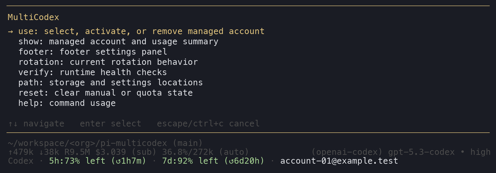
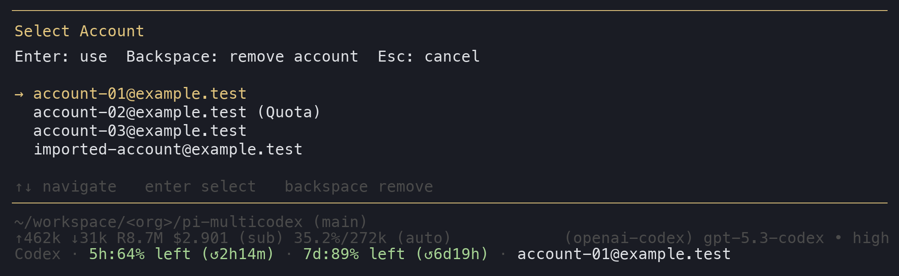
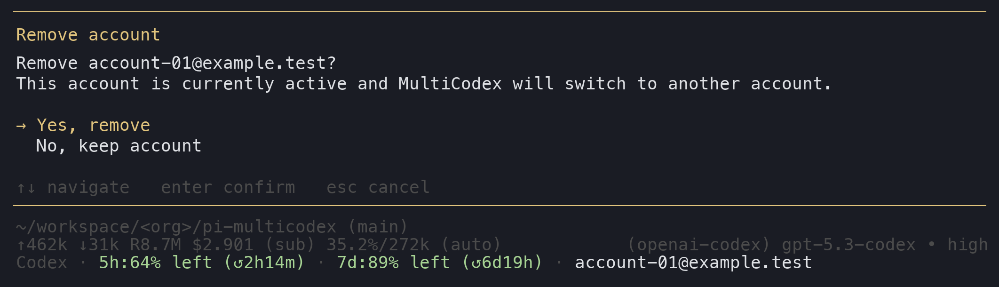

# @victor-software-house/pi-multicodex



`@victor-software-house/pi-multicodex` is a pi extension that rotates multiple ChatGPT Codex OAuth accounts for the `openai-codex-responses` API.

## What it does

- overrides the normal `openai-codex` path instead of requiring a separate provider to be selected
- auto-imports pi's stored `openai-codex` auth when it is new or changed
- rotates accounts on quota and rate-limit failures
- prefers untouched accounts when usage data is available
- otherwise prefers the account whose weekly window resets first
- keeps the implementation focused on Codex account rotation

## Why teams pick it

- one operator command family instead of scattered commands (`/multicodex ...`)
- account operations are fast in-session (`/multicodex use` picker with `Backspace` remove + confirmation)
- non-UI operations are available for inspection and recovery (`show`, `verify`, `path`, `reset`, `help`)
- settings and account state use stable local paths under `~/.pi/agent/`
- release and quality checks are automated through CI and semantic-release

## Install

```bash
pi install npm:@victor-software-house/pi-multicodex
```

Restart `pi` after installation.

## Local development

This repo uses `mise` to pin tools and `pnpm` for dependency management.

```bash
mise install
pnpm install
pnpm check
```

Equivalent mise tasks:

```bash
mise run install
mise run check
mise run pack-dry
```

Run the extension directly during local development:

```bash
pi -e ./index.ts
```

## Command family

The extension now uses one command family:

- `/multicodex`
  - open the main interactive UI
- `/multicodex show`
  - show managed account status and cached usage
- `/multicodex use [identifier]`
  - with an identifier, activate existing auth or trigger login
  - with no identifier, open the account picker
  - in the picker, `Backspace` removes the highlighted account after confirmation
- `/multicodex footer`
  - open footer settings in interactive mode
  - show footer settings summary in non-interactive mode
- `/multicodex rotation`
  - show current hard-coded rotation policy
- `/multicodex verify`
  - verify writable local paths and report runtime summary
- `/multicodex path`
  - show storage and settings file paths
- `/multicodex reset [manual|quota|all]`
  - reset manual override state, quota cooldown state, or both
- `/multicodex help`
  - print compact usage text

Dynamic autocomplete is available for subcommands and for `/multicodex use <identifier>`.

## Screenshots

All screenshots below are synthetic renders from sanitized control-sequence layouts. They reflect the current command family and footer coloring without exposing real credentials.

### `/multicodex use` account picker



### Remove account confirmation



## Architecture overview

The implementation is currently organized around these modules:

- `provider.ts`
  - overrides the normal `openai-codex` provider path
  - mirrors Codex models and installs the managed stream wrapper
- `stream-wrapper.ts`
  - account selection, retry, and quota-rotation path during streaming
- `account-manager.ts`
  - managed account storage, token refresh, usage cache, activation logic, and auth import sync
- `auth.ts`
  - reads pi's `~/.pi/agent/auth.json` and extracts importable `openai-codex` OAuth state
- `status.ts`
  - footer rendering, footer settings persistence, footer settings panel, and footer status refresh logic
- `commands.ts`
  - `/multicodex` command-family routing, autocomplete, and account-selection flows
- `hooks.ts`
  - session-start and session-switch refresh behavior
- `storage.ts`
  - persisted account state in `~/.pi/agent/codex-accounts.json`

## Project direction

This project is maintained as its own package and release line.

Current direction:

- package name: `@victor-software-house/pi-multicodex`
- Codex-only scope
- local account state stored at `~/.pi/agent/codex-accounts.json`
- footer and future extension settings stored under `pi-multicodex` in `~/.pi/agent/settings.json`
- internal logic split into focused modules today, with a broader shared controller planned next
- current roadmap tracked in `ROADMAP.md`

Current next milestones:

1. Persist footer settings immediately instead of waiting for panel close.
2. Add configurable rotation settings and document the rotation behavior contract.
3. Broaden the current footer controller into a shared MultiCodex controller.
4. Improve imported-account labels by deriving email identity safely when possible.

## Behavior contract

The current runtime behavior is:

### Account selection priority

1. Use the manual account selected with `/multicodex use` when it is still available.
2. Otherwise clear the stale manual override and select the best available managed account.
3. Best-account selection prefers:
   - untouched accounts with usage data
   - then the account whose weekly reset window ends first
   - then a random available account as fallback

### Quota exhaustion semantics

- Quota and rate-limit style failures are detected from provider error text.
- When a request fails before any output is streamed, MultiCodex marks that account exhausted and retries on another account.
- Exhaustion lasts until the next known reset time.
- If usage data does not provide a reset time, exhaustion falls back to a 1 hour cooldown.

### Retry policy

- MultiCodex retries account rotation up to 5 times for a single request.
- Retries only happen for quota and rate-limit style failures that occur before output is forwarded.
- Once output has started streaming, the original error is surfaced instead of rotating.

### Manual override behavior

- `/multicodex use <identifier>` sets the manual account override immediately.
- `/multicodex use` with no argument opens the account picker and sets the selected manual override.
- Manual override is session-local state.
- Manual override clears automatically when the selected account is no longer available or when it hits quota during rotation.

### Usage cache and refresh rules

- Usage is cached in memory for 5 minutes per account.
- Footer updates render cached usage immediately and refresh in the background when needed.
- Rapid `model_select` changes debounce background refresh work so non-Codex model switching clears the footer immediately.

### Error classification

Quota rotation currently treats these error classes as interchangeable:

- HTTP `429`
- `quota`
- `usage limit`
- `rate limit`
- `too many requests`
- `limit reached`

## Release validation

Minimum release checks:

```bash
pnpm check
npm pack --dry-run
```

## Release process

This repository uses `semantic-release` with npm trusted publishing.

Maintainer flow:

1. Write Conventional Commits.
2. The local `commit-msg` hook validates commit messages with Lefthook + commitlint.
3. CI validates commit messages again and runs release checks.
4. Merge to `main`.
5. GitHub Actions runs `semantic-release` from `.github/workflows/publish.yml`.
6. `semantic-release` computes the next version, creates the git tag and GitHub release, updates `package.json` and `CHANGELOG.md`, and publishes to npm through trusted publishing.

Local verification:

```bash
pnpm check
npm pack --dry-run
pnpm release:dry
```

Local push protection:

- `lefthook` runs `mise run pre-push`
- the `pre-push` mise task runs the same core validations as CI:
  - `pnpm check`
  - `npm pack --dry-run`

Do not use local `npm publish` for normal releases in this repo.

## npm trusted publishing setup

npm-side setup is required in addition to the workflow.

Trusted publisher mapping:

- package: `@victor-software-house/pi-multicodex`
- repository: `victor-founder/pi-multicodex`
- workflow file: `.github/workflows/publish.yml`

Useful commands:

```bash
npm trust list @victor-software-house/pi-multicodex
script -q /dev/null bash -lc 'npm trust github @victor-software-house/pi-multicodex --repository victor-founder/pi-multicodex --file publish.yml --yes'
```

## Related docs

- `ROADMAP.md` for planned milestones and acceptance criteria
- `AGENTS.md` for repository-specific agent guidance

## Acknowledgment

This project descends from earlier MultiCodex work. Thanks to the original creator for the starting point that made this package possible.

The active-account usage footer work also draws on ideas from `calesennett/pi-codex-usage`. Thanks to its author for the reference implementation and footer design.
