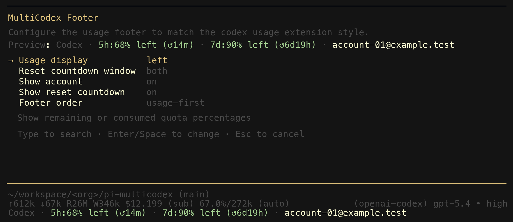

# @victor-software-house/pi-multicodex


MultiCodex is a [pi](https://github.com/badlogic/pi-mono) extension that manages multiple ChatGPT Codex accounts and rotates between them automatically when you hit quota limits.

You add your Codex accounts once. After that, MultiCodex transparently picks the best available account for every request. When one account runs dry mid-session, it switches to another and retries — no manual intervention needed.

## Getting started

Install from npm:

```bash
pi install npm:@victor-software-house/pi-multicodex
```

Restart pi. That is all you need — MultiCodex takes over the normal `openai-codex` provider path and auto-imports any Codex auth you have already set up in pi.

To manage your accounts inside a session, type `/multicodex`.

## How it works

When you start a session, MultiCodex:

1. Imports your existing pi Codex auth automatically (if present).
2. Checks usage data across all managed accounts.
3. Picks the best available account — untouched accounts first, then the one whose weekly reset window ends soonest, then a random available account as fallback.

If you pin a specific account with `/multicodex use`, that account is used until it hits quota or you clear the override.

When a request hits a quota or rate limit **before** any output is streamed, MultiCodex marks that account exhausted, picks the next available one, and retries. This happens up to 5 times transparently. If the manual override account fails, the override is cleared and rotation continues with the remaining accounts. Once output has started streaming, the error is surfaced as-is — no mid-stream account switching.

## Commands

Everything lives under one command: `/multicodex`.

| Command | What it does |
|---|---|
| `/multicodex` | Open the main interactive menu |
| `/multicodex show` | Print account status and cached usage |
| `/multicodex use [identifier]` | Activate an account, or open the picker if no identifier given |
| `/multicodex footer` | Configure the usage footer display |
| `/multicodex rotation` | Show the current rotation policy |
| `/multicodex verify` | Check that local storage paths are writable |
| `/multicodex path` | Print storage and settings file locations |
| `/multicodex reset [manual\|quota\|all]` | Clear manual override, quota cooldowns, or both |
| `/multicodex help` | Print a compact usage line |

All subcommands support dynamic autocomplete. `/multicodex use` also autocompletes from your managed account list.

Commands that do not need a UI panel (`show`, `verify`, `path`, `reset`, `help`) work in non-interactive mode too.

## Account picker

The `/multicodex use` picker lets you select, add, and remove accounts in one place.


- **Enter** activates the highlighted account.
- **Backspace** removes it (after confirmation).

When you remove an active account, MultiCodex switches to the next available one automatically.


## Usage footer

MultiCodex adds a live footer to your session showing the active account, 5-hour and 7-day usage percentages, and reset countdowns. The footer updates after every turn and on account switches.

You can customize which fields appear and their ordering with `/multicodex footer`.



## What it does under the hood

- **Provider override.** MultiCodex registers itself as the `openai-codex` provider. You do not need to select a different provider or change your model — it works with whatever Codex model you already use.
- **Auth import.** When pi has stored Codex OAuth credentials, MultiCodex imports them automatically. You can also add accounts manually with `/multicodex use <email>`.
- **Token refresh.** OAuth tokens are refreshed before expiry so requests do not fail due to stale credentials.
- **Usage tracking.** Usage data is fetched from the Codex API and cached for 5 minutes per account. The footer renders cached data immediately and refreshes in the background.
- **Quota cooldown.** When an account is exhausted, it stays on cooldown until its next known reset time (or 1 hour if the reset time is unknown).

## Local development

This repo uses `mise` for tool versions and `pnpm` for dependency management.

```bash
mise install          # pin tool versions
pnpm install          # install dependencies
pnpm check            # lint + typecheck + test
npm pack --dry-run    # verify package contents
```

Run the extension directly during development:

```bash
pi -e ./index.ts
```

## Data storage

MultiCodex stores all data locally under `~/.pi/agent/`:

| File | Contents |
|---|---|
| `codex-accounts.json` | Managed account credentials and state |
| `settings.json` (key `pi-multicodex`) | Footer display preferences |

No data is sent anywhere except to the Codex API endpoints for auth refresh and usage queries.

## Release process

Releases are automated. Push a conventional commit to `main` and GitHub Actions handles versioning, changelog, npm publishing (via trusted publishing), and GitHub releases.

Local push protection via `lefthook` runs the same checks as CI before every push.

## Roadmap

See [ROADMAP.md](ROADMAP.md) for planned work including configurable rotation settings, a shared controller architecture, and immediate footer persistence.

## Prior art and how this project differs

This extension builds on ideas from two earlier pi extensions. Both deserve credit for establishing the patterns that made this project possible.

### [kim0/pi-multicodex](https://github.com/kim0/pi-multicodex)

The original MultiCodex extension by [kim0](https://github.com/kim0). It introduced the core concept: manage multiple Codex OAuth accounts and rotate between them on quota failures. The original shipped as a single `index.ts` file (~990 lines) with three top-level commands (`/multicodex-login`, `/multicodex-use`, `/multicodex-status`), a stream wrapper for transparent retries, and account selection logic that prefers untouched accounts and earliest weekly resets.

This fork diverged significantly:

- **Modular architecture.** Split into 16 focused modules (~2,400 lines of runtime code, ~1,200 lines of tests) instead of one monolithic file.
- **Command family.** One `/multicodex` command with subcommands and dynamic autocomplete, replacing three separate top-level commands.
- **Account removal.** In-session account deletion from the picker via `Backspace` with confirmation — the original had no way to remove accounts without editing the JSON file.
- **Non-interactive mode.** All inspection and recovery subcommands (`show`, `verify`, `path`, `reset`, `help`) work without a UI panel.
- **Auth import.** Automatically imports pi's stored `openai-codex` credentials when they change, so existing pi logins work without re-entering them.
- **Token refresh.** Proactively refreshes OAuth tokens before expiry instead of failing on stale credentials.
- **Automated releases.** semantic-release with npm trusted publishing, commitlint, lefthook pre-push checks, and CI validation on every push.

### [calesennett/pi-codex-usage](https://github.com/calesennett/pi-codex-usage)

A footer-only extension by [calesennett](https://github.com/calesennett) that shows Codex usage windows in the pi status bar. It introduced the idea of a live footer displaying 5-hour and 7-day usage percentages with reset countdowns, and offered two commands to toggle display mode and reset window.

This project incorporated and extended that footer concept:

- **Integrated footer.** The usage footer is part of the rotation extension rather than a separate install, so it always reflects the active rotated account.
- **More settings.** Five configurable fields (usage mode, reset window, show account, show reset countdown, footer order) compared to two toggles.
- **Settings panel.** Interactive `SettingsList` modal with live preview instead of separate toggle commands.
- **Colored segments.** Footer renders usage percentages, separators, and account labels in distinct colors matched to the terminal theme.
- **Model-aware display.** Footer clears when switching to non-Codex models and debounces rapid model changes.
